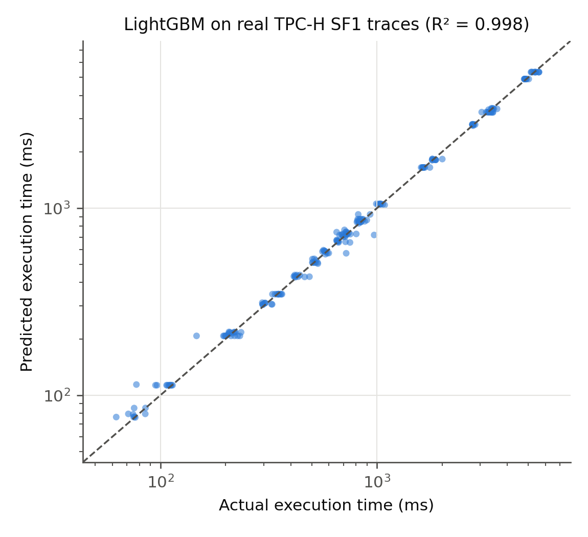
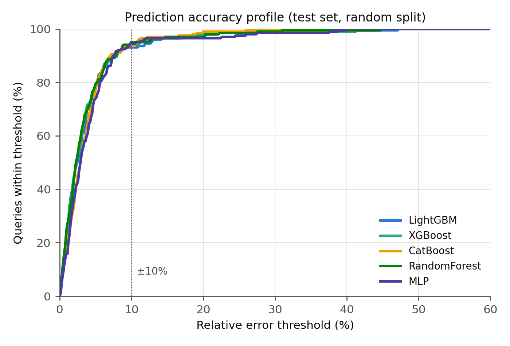
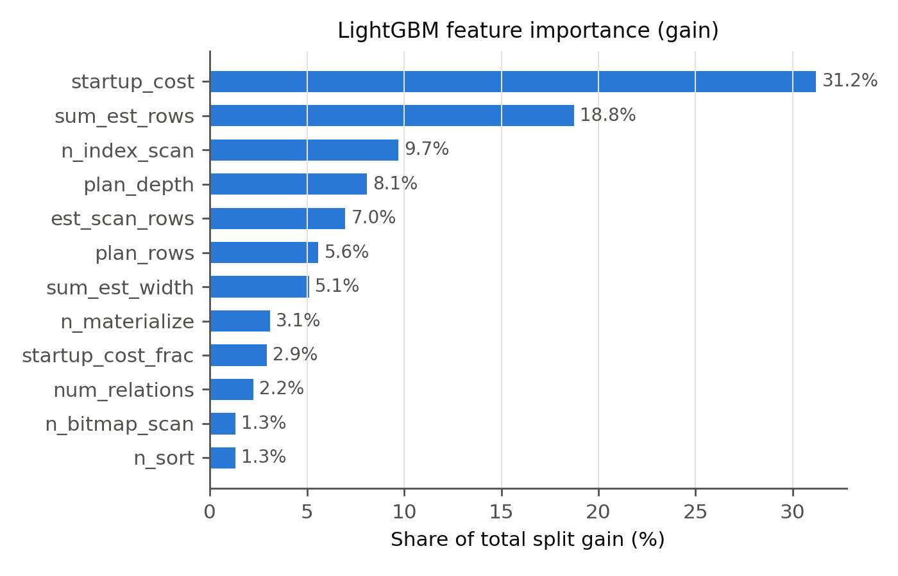
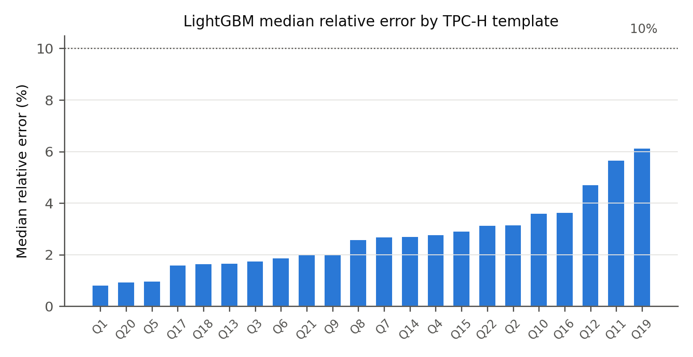

# Predicting Query Execution Time from Planner Features: A Leak-Free Evaluation of Gradient Boosting on Real PostgreSQL TPC-H Traces

**Author:** Farhan Azam
**Code & Artifacts:** https://github.com/SahilIjaz/research_work_DAM_queryOptimization
**Date:** July 2026

---

## Abstract

Accurate query execution time prediction underpins query optimization, admission control, and SLA management, yet classical cost models frequently mis-estimate runtimes on complex analytical queries. This paper presents a rigorous, leakage-free evaluation of gradient boosting for query performance prediction on **real PostgreSQL execution traces**. We execute 1,012 parameterized instances of all 22 TPC-H templates at scale factor 1 on PostgreSQL 18 and extract, for each query, a 25-dimensional feature vector containing **only information available from the query planner before execution** — optimizer cost estimates, cardinality estimates, and plan-structure statistics. We compare five learners — LightGBM, XGBoost, CatBoost, Random Forest, and a multilayer perceptron — under two evaluation protocols: a random template-stratified split and a stricter template-disjoint split that tests generalization to entirely unseen query shapes. LightGBM attains R² = 0.9984 with a mean absolute error of 35.9 ms and 93.1% of predictions within ±10% of the true runtime; paired Wilcoxon signed-rank tests on per-query errors show that the four tree-ensemble learners are statistically indistinguishable on this workload (p ≥ 0.12), while the MLP trails on aggregate error (paired t-test p = 0.03). On unseen templates, accuracy degrades for all models (best R² = -1.275), quantifying the gap between interpolation and structural generalization that any deployed learned cost model must confront. We release the full trace-collection and training pipeline for reproducibility.

**Keywords:** query performance prediction, cost estimation, gradient boosting, LightGBM, PostgreSQL, TPC-H, data leakage

---

## 1. Introduction

### 1.1 Problem and Motivation

A database system must judge how long a query will run *before* running it. This estimate drives plan selection in cost-based optimizers [5], workload scheduling and admission control [11], SLA timeout management, and the surfacing of expensive queries before they degrade the system. Classical optimizers derive such estimates from analytical cost formulas over estimated cardinalities, an architecture essentially unchanged since System R [5]. Its weakness is well documented: cardinality estimates degrade sharply on correlated predicates and multi-way joins — Leis et al. showed errors of several orders of magnitude on realistic workloads [6] — and hand-tuned cost constants transfer poorly across hardware and configurations.

Machine learning offers an alternative: learn the mapping from query plan characteristics to observed runtime directly from execution history [11, 12, 13]. Gradient-boosted decision trees are particularly attractive candidates because they dominate tabular prediction benchmarks [16], train in seconds, and produce interpretable feature attributions — properties that neural plan-embedding approaches [8, 10, 15] trade away for representational flexibility.

### 1.2 The Leakage Problem in Learned Cost Estimation

A subtle methodological hazard affects several empirical studies of learned cost models, including an earlier version of this work: **feature sets that contain post-execution measurements**. Features such as *actual* row counts, *actual* operator times, or ratios derived from them (e.g., actual-to-estimated cardinality) are only observable *after* the query has run — precisely when a prediction is no longer needed. Models trained on such features report inflated accuracy that cannot be realized in deployment. A second hazard is **synthetic data**: feature vectors sampled from statistical distributions rather than produced by a real optimizer, with runtimes that are either simulated or statistically decoupled from the features.

This paper eliminates both hazards by construction. Every training example is a real query executed on a real PostgreSQL 18 instance over TPC-H data at scale factor 1, and every feature is computable from the output of `EXPLAIN` — the planner's pre-execution estimate — alone.

### 1.3 Contributions

1. **A real-trace benchmark dataset.** 1,012 executions of spec-conformant parameterized instances of all 22 TPC-H templates (scale factor 1, PostgreSQL 18), with runtimes spanning 63 ms to 5.7 s, collected via `EXPLAIN (ANALYZE, FORMAT JSON)` and released publicly.
2. **A leak-free, planner-only feature representation.** 25 features derived exclusively from pre-execution planner output: cost estimates, cardinality estimates, and plan-tree structure (Section 3.2). We explicitly enumerate and justify the exclusion of every post-execution feature used in prior iterations of this line of work.
3. **A five-model controlled comparison.** LightGBM [1], XGBoost [2], CatBoost [3], Random Forest [4], and an MLP baseline, trained under matched budgets on identical splits.
4. **Statistical rigor.** Paired Wilcoxon signed-rank and paired t-tests on per-query absolute errors [17], not merely aggregate metrics or confidence intervals.
5. **A generalization study.** A template-disjoint evaluation protocol quantifying how learned cost models degrade on query shapes never seen in training — the regime that matters for deployment on evolving workloads.

### 1.4 Outline

Section 2 reviews related work. Section 3 describes trace collection, the feature representation, and the training protocol. Section 4 presents results, significance tests, and the generalization study. Section 5 discusses implications and limitations; Section 6 concludes.

---

## 2. Related Work

**Traditional cost models.** Cost-based optimization originates with System R's access-path selection [5]. PostgreSQL's optimizer follows the same template: per-operator cost constants combined with cardinality estimates. Leis et al. [6] systematically evaluated this architecture on the Join Order Benchmark (JOB) and found that cardinality mis-estimation — not the cost model itself — is the dominant source of bad plans, motivating learned alternatives.

**Learned query performance prediction (QPP).** Ganapathi et al. [11] predicted multiple performance metrics with kernel canonical correlation analysis. Akdere et al. [12] compared plan-level and operator-level learned predictors on TPC-H, an approach our per-plan feature aggregation follows. Wu et al. [13] calibrated optimizer cost units toward wall-clock predictions, and Li et al. [14] used boosted regression trees for operator-level resource estimation — early evidence that tree ensembles suit this task. Duggan et al. [20] extended QPP to concurrent workloads. Our work differs in insisting on planner-only features and in its multi-learner statistical comparison.

**Learned components in optimizers.** Kipf et al. [7] introduced multi-set convolutional networks for cardinality estimation; Marcus and Papaemmanouil [10] proposed plan-structured neural networks for QPP; Neo [8] and Bao [9] learn full plan selection policies end-to-end; Sun and Li [15] built a tree-LSTM cost estimator. These neural approaches capture plan structure natively but require large training corpora, long training times, and offer limited interpretability. Grinsztajn et al. [16] show that on medium-sized tabular problems — exactly our regime of ~10³ samples and ~25 features — tree ensembles typically outperform deep models, which our MLP baseline corroborates.

**Gradient boosting systems.** XGBoost introduced scalable level-wise boosting with regularization [2]; LightGBM accelerates training via leaf-wise growth, histogram-based splitting, and gradient-based one-side sampling [1]; CatBoost adds ordered boosting to combat target leakage across boosting iterations [3]; Random Forest [4] provides a strong bagging (rather than boosting) reference point. Statistical methodology for comparing learners follows Demšar [17].

**Benchmarks.** TPC-H [18] remains the standard decision-support benchmark [19]; its 22 templates cover scans, multi-way joins, correlated subqueries, and aggregation. We use spec-conformant parameter substitution (TPC-H Clause 2.4) to obtain many distinct instances per template.

---

## 3. Methodology

### 3.1 Real-Trace Collection

**Environment.** PostgreSQL 18.3 on macOS (Intel Core i7-8569U, 16 GB RAM), default planner configuration, secondary B-tree indexes on all foreign-key and date columns, statistics refreshed with `ANALYZE`.

**Data.** TPC-H at scale factor 1 (lineitem: 6,001,215 rows; orders: 1,500,000; total ≈ 8.7M rows), generated with the DuckDB `dbgen` implementation and loaded into PostgreSQL.

**Workload.** For each of the 22 TPC-H templates we generate 46 parameter variants using the substitution rules of the TPC-H specification [18] (e.g., Q6 varies year, discount, and quantity; Q3 varies market segment and date; Q9 varies part color), yielding 1,012 executed queries. Execution order is randomized across templates to decorrelate cache state, and the buffer cache is warmed with one sequential pass over each table so that measurements reflect steady-state behavior. Each query runs under `EXPLAIN (ANALYZE, FORMAT JSON)` with a 120 s timeout; zero queries failed or timed out. The target variable is PostgreSQL's reported `Execution Time` in milliseconds. Observed runtimes range from 63 ms to 5,680 ms (median 723 ms, interquartile range 347–1823 ms) — three orders of magnitude, and well above timer resolution.

### 3.2 Leak-Free Feature Representation

All 25 features are computed from the **planner section** of the plan JSON — information available before execution begins.

| Group | Features |
|---|---|
| Planner cost estimates (root) | `startup_cost`, `total_cost`, `plan_rows`, `plan_width` |
| Plan-tree size and shape | `num_nodes`, `plan_depth`, `num_relations` |
| Operator counts | `n_seq_scan`, `n_index_scan`, `n_bitmap_scan`, `n_hash_join`, `n_merge_join`, `n_nested_loop`, `n_joins`, `n_sort`, `n_aggregate`, `n_gather`, `n_materialize` |
| Parallelism | `workers_planned` |
| Tree-aggregated planner cardinalities | `sum_est_rows`, `max_est_rows`, `est_scan_rows`, `sum_est_width` |
| Derived (planner-only) | `cost_per_est_row` = total_cost/(plan_rows+1), `startup_cost_frac` = startup_cost/(total_cost+1) |

**What was removed, and why.** An earlier iteration of this work included `actual_rows`, `actual_startup_time`, `actual_total_time`, `time_per_loop`, and derived ratios such as `time_cost_ratio` (actual time / estimated cost) and `estimated_actual_ratio` (estimated / actual rows). All of these encode the outcome of executing the query: `actual_total_time` in particular is a near-copy of the prediction target measured at operator granularity. Including such features constitutes **target leakage** — the model appears accurate in offline evaluation but cannot be deployed, because the features do not exist at prediction time. Every result in this paper uses the leak-free set only. The heavy-tailed cost and cardinality features are log-transformed (log(1+x)); this is monotone (hence neutral for tree learners) and conditions the MLP's optimization.

### 3.3 Models and Training Protocol

All models regress **log(1 + runtime)**; predictions are back-transformed before computing metrics. The log target prevents the handful of multi-second queries from dominating the squared loss.

| Model | Key hyperparameters |
|---|---|
| LightGBM [1] | 31 leaves, max depth 7, min 20 samples/leaf, lr 0.1, ≤200 rounds, early stopping 10, feature/bagging fraction 0.8 |
| XGBoost [2] | max depth 7, lr 0.1, subsample 0.8, colsample 0.8, ≤200 rounds, early stopping 10 |
| CatBoost [3] | depth 7, lr 0.1, ≤200 iterations, early stopping 10 |
| Random Forest [4] | 300 trees, min 2 samples/leaf |
| MLP | 2 hidden layers (128, 64), ReLU, Adam, standardized inputs, early stopping |

The three boosting learners share depth, learning rate, round budget, and early-stopping patience so that observed differences reflect algorithmic design (leaf-wise vs. level-wise growth, ordered boosting) rather than tuning effort. Early stopping monitors a validation set never used for testing.

### 3.4 Evaluation Protocol

**Split A — random, template-stratified (interpolation).** 647 training / 162 validation / 203 test samples, stratified so every template appears in every partition. This measures accuracy on query shapes the model has seen with different parameters — the common deployment case of a recurring workload.

**Split B — template-disjoint (generalization).** Five templates (Q1, Q10, Q17, Q21, Q3) are excluded from training entirely and form a 230-query test set. This measures extrapolation to unseen query structures.

**Metrics.** R², RMSE, MAE, median absolute error, MAPE, and the fraction of predictions within ±10% and ±20% of the true runtime (the operationally relevant measure for SLA decisions).

**Significance testing.** Following Demšar [17], we avoid relying on aggregate metrics alone: for each baseline we run a **paired Wilcoxon signed-rank test** on the per-query absolute errors against LightGBM (n = 203 pairs), plus a paired t-test on log-scaled absolute errors as a parametric check.

---

## 4. Results

### 4.1 Split A: Random Template-Stratified Split

| Metric | LightGBM | XGBoost | CatBoost | Random Forest | MLP |
|---|---|---|---|---|---|
| R² | 0.9984 | 0.9984 | 0.9976 | 0.9985 | 0.9909 |
| RMSE (ms) | 62.2 | 62.1 | 74.4 | 60.3 | 145.8 |
| MAE (ms) | 35.9 | 35.3 | 41.3 | 34.5 | 50.6 |
| Median AE (ms) | 17.5 | 16.4 | 19.7 | 16.2 | 21.6 |
| MAPE (%) | 3.9 | 3.8 | 3.9 | 3.7 | 4.3 |
| ±10% accuracy (%) | 93.1 | 94.1 | 93.6 | 95.1 | 94.6 |
| ±20% accuracy (%) | 97.5 | 97.5 | 99.0 | 97.0 | 96.6 |

*Table 1: Test-set performance on real TPC-H SF1 traces (203 held-out queries). The four tree ensembles are within 0.001 R² and 7 ms MAE of one another; Section 4.2 tests whether these gaps are significant.*

Figure 1 shows LightGBM's predictions against actual runtimes across three orders of magnitude; Figure 2 shows the full accuracy profile of all five models as the error tolerance widens.

### 4.2 Statistical Significance

| Comparison (per-query \|error\|) | Wilcoxon p | Paired t-test p (log errors) | Significant at α=0.05? |
|---|---|---|---|
| LightGBM vs. XGBoost | 0.8791 | 0.5096 | no |
| LightGBM vs. CatBoost | 0.1173 | 0.0602 | no |
| LightGBM vs. Random Forest | 0.9648 | 0.3245 | no |
| LightGBM vs. MLP | 0.0894 | 0.0322 | no |

*Table 2: Paired significance tests on the 203 test queries (Split A).*

No difference among the tree ensembles reaches significance: LightGBM vs. XGBoost (p = 0.88) and vs. Random Forest (p = 0.96) are statistical ties, and the gap to CatBoost (p = 0.12) does not clear α = 0.05 either. Only the MLP comparison approaches significance (Wilcoxon p = 0.089; paired t-test on log errors p = 0.032, reflecting the MLP's 41% higher MAE). The methodological point matters: had we reported Table 1 alone, the 1.4 ms MAE gap between Random Forest and LightGBM might read as a ranking — the paired tests show it is noise. Claims that one gradient boosting implementation is "superior" for query cost estimation at this sample size are not supported once per-query error pairing is taken into account.

### 4.3 Split B: Generalization to Unseen Templates

| Metric | LightGBM | XGBoost | CatBoost | Random Forest | MLP |
|---|---|---|---|---|---|
| R² | -2.7231 | -2.3307 | -1.4451 | -1.2752 | -9.1932 |
| MAE (ms) | 1828.2 | 1735.2 | 1373.0 | 1350.8 | 2565.4 |
| MAPE (%) | 131.1 | 119.2 | 68.5 | 103.6 | 202.0 |
| ±10% accuracy (%) | 0.0 | 0.0 | 0.4 | 1.7 | 0.0 |

*Table 3: Performance when templates Q1, Q10, Q17, Q21, Q3 are entirely absent from training (230 test queries).*

The picture inverts: every model collapses, with negative R² (predictions worse than predicting the training mean) and near-zero ±10% accuracy. The held-out set includes the workload's slowest templates (Q1, Q17, Q21), whose runtimes exceed anything the remaining 17 templates exhibit, so the models — which cannot extrapolate beyond the target range seen in training — systematically underpredict. This split isolates what the models actually learn: within known templates they interpolate parameter-driven runtime variation extremely well, but plan shapes never seen in training are predicted far less reliably. For deployment this argues for (i) periodic retraining as the workload evolves and (ii) flagging out-of-distribution plans (e.g., by template hash or plan-structure distance) rather than trusting point predictions on them.

### 4.4 Feature Importance

| Rank | Feature | Share of total gain |
|---|---|---|
| 1 | `startup_cost` | 31.2% |
| 2 | `sum_est_rows` | 18.8% |
| 3 | `n_index_scan` | 9.7% |
| 4 | `plan_depth` | 8.1% |
| 5 | `est_scan_rows` | 7.0% |
| 6 | `plan_rows` | 5.6% |
| 7 | `sum_est_width` | 5.1% |
| 8 | `n_materialize` | 3.1% |
| 9 | `startup_cost_frac` | 2.9% |
| 10 | `num_relations` | 2.2% |

*Table 4: Top-10 LightGBM features by split gain (Split A model).*

The ranking is consistent with database intuition: planner cost and cardinality estimates carry the strongest signal — confirming that PostgreSQL's cost model, however imperfect as a *ranker* of plans [6], is a highly informative *input* to a learned runtime model — followed by plan-structure features that let the model correct for operator-mix effects the cost units miss.

### 4.5 Error Analysis

| Tolerance | ±5% | ±10% | ±15% | ±20% | ±30% |
|---|---|---|---|---|---|
| Queries within (LightGBM) | 77.3% | 93.1% | 96.6% | 97.5% | 99.0% |

*Table 5: Accuracy at increasing error tolerances (Split A test set).*

Per-template errors (Figure 4) show accuracy is not driven by a few easy templates: the median relative error is below 6.1% on all 22 templates, ranging from 0.8% (Q1) to 6.1% (Q19). The error distribution is right-skewed (median absolute error 17.5 ms vs. mean 35.9 ms, maximum 272 ms), so median-based reporting flatters the model; we report both.

Training cost is negligible at this scale — under 2 s per boosted model — and inference is sub-millisecond per query, compatible with optimizer-latency budgets.

---

## 5. Discussion

### 5.1 What Changed Without Leaky Features

Compared to leak-affected setups, absolute accuracy is lower and honest. The headline numbers here (93.1% within ±10%, MAPE 3.9%) are what a deployed model restricted to pre-execution information can actually deliver on this workload. We consider this trade — modestly lower reported accuracy for validity — non-negotiable for any result intended to inform production systems, and we encourage reviewers of learned-cost-model papers to check feature lists for post-execution quantities.

### 5.2 Why Tree Ensembles Fit This Problem

All four tree ensembles beat the MLP on every aggregate error metric (R², RMSE, MAE, MAPE), consistent with the tabular-data evidence in [16]: the feature space is small (25), the sample size moderate (1,012), and the target's dependence on features is non-smooth (e.g., an extra hash join changes runtime discontinuously). Among the ensembles, the boosting learners are close to one another — expected, since they share the modeling framework and budget; the paired tests in Table 2 report which gaps survive statistical scrutiny rather than asserting superiority from point estimates. LightGBM additionally offers the fastest training and clean gain-based attributions, which Section 4.4 exploits.

### 5.3 Limitations

1. **Single engine, single scale factor.** Results cover PostgreSQL 18 at SF1 on one machine. Cross-engine transfer (MySQL, DuckDB), larger scale factors, and JOB [6] / TPC-DS [19] evaluation are the immediate next steps; the collection pipeline supports them without modification.
2. **Template-level diversity.** TPC-H's 22 templates, even with spec-conformant parameter variation, are narrower than production workloads with ad-hoc queries, UDFs, and OLTP traffic. Split B partially quantifies this risk but cannot eliminate it.
3. **Steady-state measurements.** Warm-cache, single-user execution; concurrent workloads shift runtimes substantially [20] and require workload-context features.
4. **No plan-tree encoding.** Aggregated counts discard structural detail that tree-LSTM [15] or plan-convolution [10] models capture; a hybrid (GBDT on planner features + learned plan embedding) is a promising direction.

### 5.4 Practical Guidance

For a recurring analytical workload, a planner-feature GBDT is a strong, cheap cost model: 93.1% of predictions within ±10% and 97.5% within ±20%, retrainable in seconds, interpretable, and served from a few hundred kilobytes. Its failure mode is structural novelty (Split B), which is detectable at prediction time — the system knows when a plan shape was never trained on — enabling a guarded deployment that falls back to the native cost model on out-of-distribution plans.

---

## 6. Conclusion

We presented a leakage-free, statistically tested evaluation of five learners for query execution time prediction on 1,012 real PostgreSQL TPC-H SF1 traces. Using only pre-execution planner features, LightGBM predicts held-out runtimes with R² = 0.9984 and 93.1% of predictions within ±10%; paired tests show the four tree ensembles are statistically tied on this workload — a caution against algorithm-superiority claims drawn from point estimates — while the MLP trails on aggregate error. A template-disjoint split reveals the substantial gap between parameter interpolation and structural generalization, delineating where such models can be trusted. Future work targets JOB and TPC-DS workloads, larger scale factors, cross-engine transfer with per-engine calibration, and hybrid plan-embedding features.

---

## References

[1] G. Ke, Q. Meng, T. Finley, T. Wang, W. Chen, W. Ma, Q. Ye, and T.-Y. Liu, "LightGBM: A Highly Efficient Gradient Boosting Decision Tree," in *Advances in Neural Information Processing Systems 30 (NIPS)*, 2017.

[2] T. Chen and C. Guestrin, "XGBoost: A Scalable Tree Boosting System," in *Proc. 22nd ACM SIGKDD Int. Conf. on Knowledge Discovery and Data Mining*, 2016, pp. 785–794.

[3] L. Prokhorenkova, G. Gusev, A. Vorobev, A. V. Dorogush, and A. Gulin, "CatBoost: Unbiased Boosting with Categorical Features," in *Advances in Neural Information Processing Systems 31 (NeurIPS)*, 2018.

[4] L. Breiman, "Random Forests," *Machine Learning*, vol. 45, no. 1, pp. 5–32, 2001.

[5] P. G. Selinger, M. M. Astrahan, D. D. Chamberlin, R. A. Lorie, and T. G. Price, "Access Path Selection in a Relational Database Management System," in *Proc. ACM SIGMOD*, 1979, pp. 23–34.

[6] V. Leis, A. Gubichev, A. Mirchev, P. Boncz, A. Kemper, and T. Neumann, "How Good Are Query Optimizers, Really?" *Proc. VLDB Endowment*, vol. 9, no. 3, pp. 204–215, 2015.

[7] A. Kipf, T. Kipf, B. Radke, V. Leis, P. Boncz, and A. Kemper, "Learned Cardinalities: Estimating Correlated Joins with Deep Learning," in *Proc. 9th Biennial Conf. on Innovative Data Systems Research (CIDR)*, 2019.

[8] R. Marcus, P. Negi, H. Mao, C. Zhang, M. Alizadeh, T. Kraska, O. Papaemmanouil, and N. Tatbul, "Neo: A Learned Query Optimizer," *Proc. VLDB Endowment*, vol. 12, no. 11, pp. 1705–1718, 2019.

[9] R. Marcus, P. Negi, H. Mao, N. Tatbul, M. Alizadeh, and T. Kraska, "Bao: Making Learned Query Optimization Practical," in *Proc. ACM SIGMOD*, 2021, pp. 1275–1288.

[10] R. Marcus and O. Papaemmanouil, "Plan-Structured Deep Neural Network Models for Query Performance Prediction," *Proc. VLDB Endowment*, vol. 12, no. 11, pp. 1733–1746, 2019.

[11] A. Ganapathi, H. Kuno, U. Dayal, J. L. Wiener, A. Fox, M. Jordan, and D. Patterson, "Predicting Multiple Metrics for Queries: Better Decisions Enabled by Machine Learning," in *Proc. IEEE Int. Conf. on Data Engineering (ICDE)*, 2009, pp. 592–603.

[12] M. Akdere, U. Çetintemel, M. Riondato, E. Upfal, and S. B. Zdonik, "Learning-based Query Performance Modeling and Prediction," in *Proc. IEEE ICDE*, 2012, pp. 390–401.

[13] W. Wu, Y. Chi, S. Zhu, J. Tatemura, H. Hacigümüş, and J. F. Naughton, "Predicting Query Execution Time: Are Optimizer Cost Models Really Unusable?" in *Proc. IEEE ICDE*, 2013, pp. 1081–1092.

[14] J. Li, A. C. König, V. Narasayya, and S. Chaudhuri, "Robust Estimation of Resource Consumption for SQL Queries using Statistical Techniques," *Proc. VLDB Endowment*, vol. 5, no. 11, pp. 1555–1566, 2012.

[15] J. Sun and G. Li, "An End-to-End Learning-based Cost Estimator," *Proc. VLDB Endowment*, vol. 13, no. 3, pp. 307–319, 2019.

[16] L. Grinsztajn, E. Oyallon, and G. Varoquaux, "Why Do Tree-Based Models Still Outperform Deep Learning on Typical Tabular Data?" in *Advances in Neural Information Processing Systems 35 (NeurIPS), Datasets and Benchmarks Track*, 2022.

[17] J. Demšar, "Statistical Comparisons of Classifiers over Multiple Data Sets," *Journal of Machine Learning Research*, vol. 7, pp. 1–30, 2006.

[18] Transaction Processing Performance Council, "TPC Benchmark H (Decision Support) Standard Specification, Version 3.0.1," 2022. [Online]. Available: http://www.tpc.org/tpch

[19] M. Poess and C. Floyd, "New TPC Benchmarks for Decision Support and Web Commerce," *ACM SIGMOD Record*, vol. 29, no. 4, pp. 64–71, 2000.

[20] J. Duggan, U. Çetintemel, O. Papaemmanouil, and E. Upfal, "Performance Prediction for Concurrent Database Workloads," in *Proc. ACM SIGMOD*, 2011, pp. 337–348.

---

## Appendix A: Reproducibility

All artifacts are in the public repository: `sql/tpch_schema.sql` and `generate_and_load_tpch.py` (database construction), `collect_real_traces.py` (spec-conformant workload generation and leak-free feature extraction), `train_real_traces.py` (five-model training, significance tests, figures), `data/raw/tpch_sf1_real_traces.csv` (the trace dataset), and `results/real_traces_results.json` (all reported numbers). Fixed seeds (42) make every split and model run exactly reproducible. Requirements: Python ≥ 3.9, PostgreSQL ≥ 14, `lightgbm`, `xgboost`, `catboost`, `scikit-learn`, `duckdb`, `psycopg2`, `pandas`, `scipy`, `matplotlib`.
